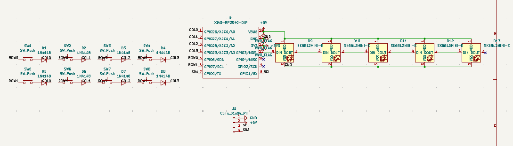
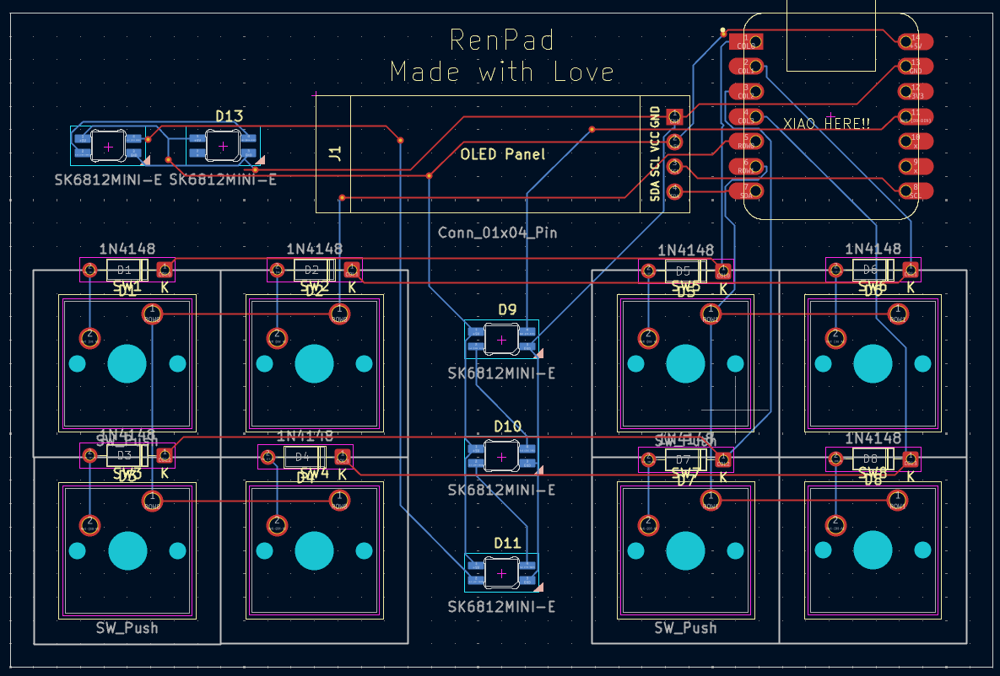
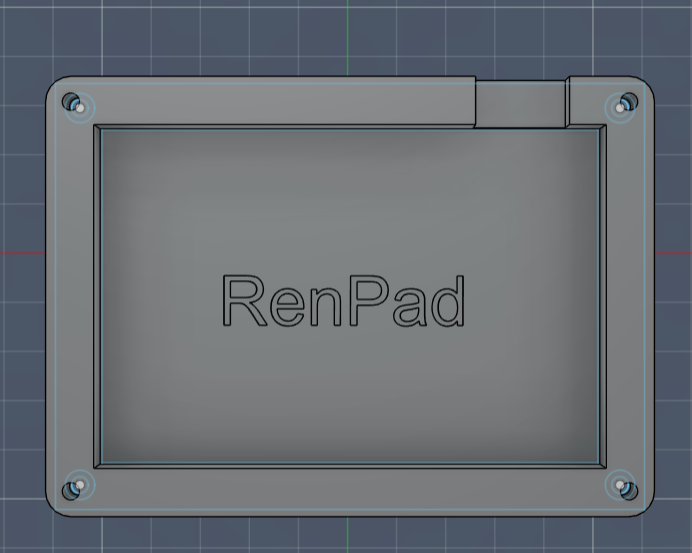
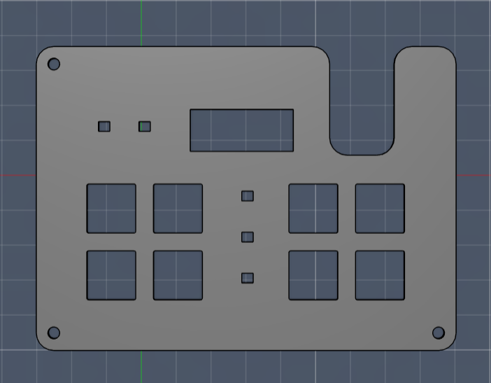
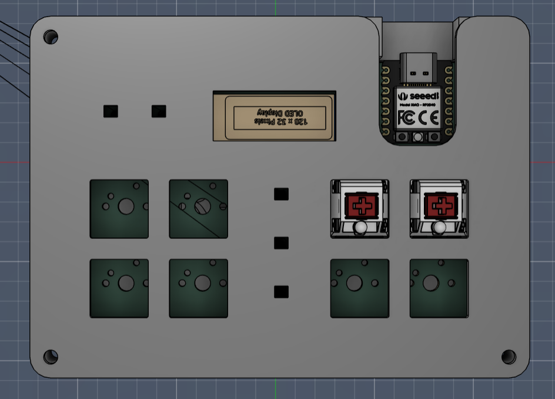

# RenPad
RenPad is a compact 8-key productivity macropad powered by the Seeed XIAO RP2040.  
It’s designed as a dedicated Windows control deck with an OLED status display and RGB underglow for everyday workflow speed.

---

## Features
- 8 Cherry MX mechanical keys  
- 128×32 OLED display (status + key feedback)  
- 5× SK6812MINI-E RGB LEDs  
- Seeed XIAO RP2040 microcontroller  
- KMK firmware (CircuitPython-based)  
- Fully custom PCB  
- 3D-printed case  

---

## Project Images

### Schematic


### PCB


### Case Design

**Bottom Case**  


**Top Case**  


### Final Build


---

## System Overview

### MCU
Seeed Studio XIAO RP2040 (Through-hole)

### Inputs
8× Cherry MX mechanical switches

### Outputs
128×32 OLED display (I²C)  
5× SK6812MINI-E RGB LEDs  

---

## Pin Mapping

| Function | GPIO |
|---|---|
| ROW0 | GPIO6 |
| ROW1 | GPIO7 |
| COL0 | GPIO26 |
| COL1 | GPIO27 |
| COL2 | GPIO28 |
| COL3 | GPIO29 |
| RGB Data | GPIO3 |
| OLED SDA | GPIO0 |
| OLED SCL | GPIO1 |

---

## Key Layout (Windows Control Deck)

| Key | Shortcut | Function |
|---|---|---|
| K1 | Win + V | Clipboard history |
| K2 | Alt + Tab | Switch apps |
| K3 | Win + Tab | Task view |
| K4 | Win + E | File Explorer |
| K5 | Ctrl + Shift + Esc | Task Manager |
| K6 | Win + Ctrl + D | New virtual desktop |
| K7 | Win + Ctrl + ← | Desktop left |
| K8 | Win + Ctrl + → | Desktop right |

---

## Bill of Materials (BOM)

| Part | Quantity | Manufacturer | Part Number |
|---|---|---|---|
| Seeed XIAO RP2040 (TH) | 1 | Seeed Studio | 102010428 |
| Cherry MX Mechanical Switch | 8 | Cherry | MX Series |
| 1N4148 Diodes (TH) | 8 | Vishay | 1N4148 |
| SK6812MINI-E LEDs | 5 | WorldSemi | SK6812MINI-E |
| 128×32 OLED Display | 1 | Generic | SSD1306 |
| DSA Keycaps | 8 | Generic | DSA Blank |
| M3 Screws | 4 | Generic | M3 |
| Heatset Inserts | 4 | Generic | M3 |

---

## Firmware
RenPad runs on **KMK (CircuitPython)** firmware.

The firmware supports:
- Key matrix scanning  
- OLED key feedback display  
- RGB underglow effects  
- Windows productivity shortcuts  

Firmware is located in the **Firmware/** folder.

---

## Case
The enclosure is fully 3D-printed and designed in Fusion 360.

It consists of:
- Bottom shell  
- Top plate  
- Heatset insert mounts  

Exported as STEP files in the **CAD/** folder.

---

## Author
Designed and built by **Rupnil.Codes**
Hack Club Hackpad Project
```
